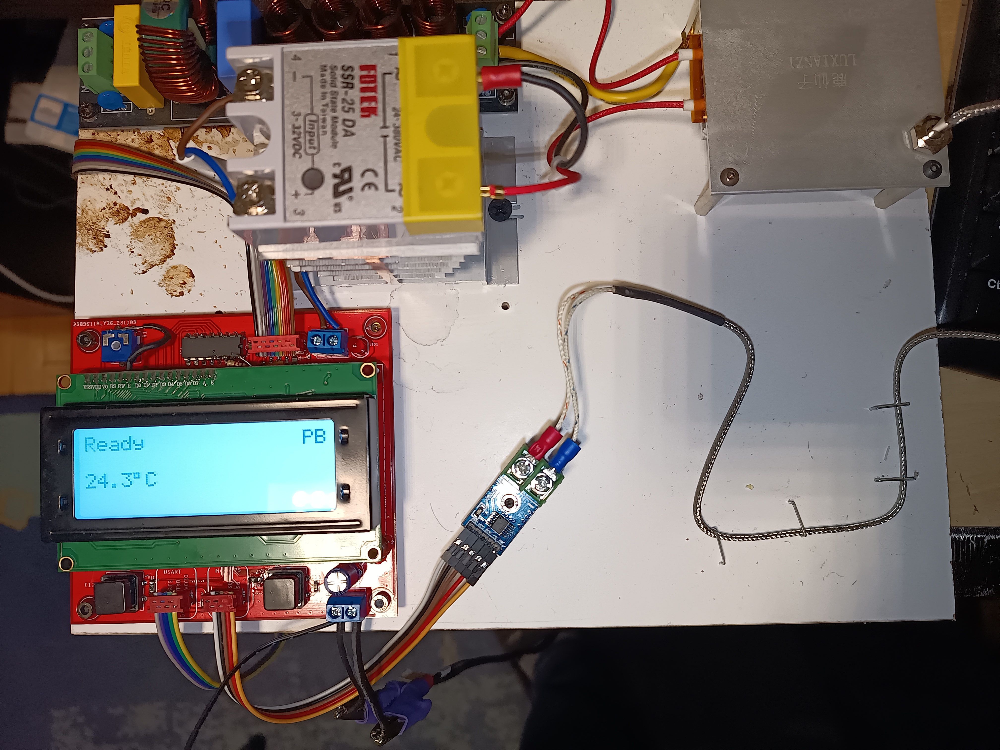
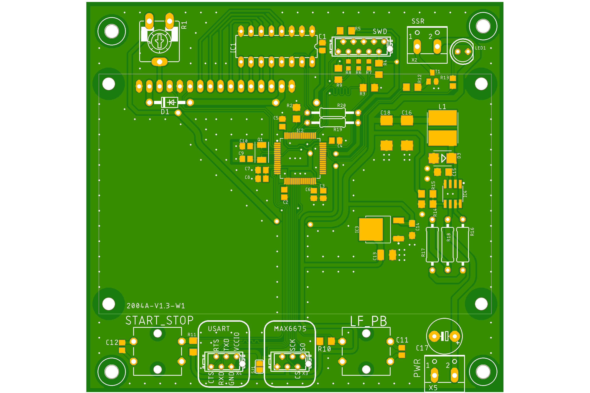

# pcb-reflow-stm32-rust-rtic

## Software

Rust code for STM32F411RCT6 microcontroller to drive PCB reflow solder plate.
Code is based on https://github.com/gabrielvegamotta/PCB-Reflow/blob/main/V1-Arduino-PTH/Firmware/PCB_Reflow_V1.6.ino

## Hardware

The whole setup look like this:

This is how the PCB top layer look like:

Here you have [schematics in PDF](./docs/hardware/mainboard_v3.pdf)

I'm using MAX6675 as a temperature sensor. You can get it for example from here:
https://botland.store/high-precision-temperature-sensors/12504-max6675-thermocouple-spi-temperature-sensor-5904422307868.html

PCB was designed with Autodesk EAGLE. 
- [schematics](./docs/hardware/mainboard_v3.sch)
- [PCB project](./docs/hardware/mainboard_v3.brd)

If you want to order a PCB, here you have [gerber files](./docs/hardware/mainboard_v3_2023-11-27.zip)